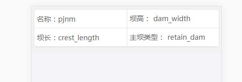

## 通用列表

- 自定义模版
- 增删改查

## 示例

- 第一步

```bash
npm install chika-component --save-dev
```

- 第二步

```tsx
import React from 'react';
import './css/container-demo.css';

export default () => (
  <div className="container-demo">
    <ul>
      <li>
        <div className="left">
          <label>名称：</label>
          <label>pjnm</label>
        </div>
        <div className="right">
          <label>坝高：</label>
          <label>dam_width</label>
        </div>
      </li>
      <li>
        <div className="left">
          <label>坝长：</label>
          <label>crest_length</label>
        </div>
        <div className="right">
          <label>主坝类型：</label>
          <label>retain_dam</label>
        </div>
      </li>
    </ul>
  </div>
);
```

- 效果图
  

- 第三步

  觉着没问题以后再加点细节

```tsx
import React from 'react';
import { Container } from 'chika-component';
import './css/container-demo.css';

export default () => (
  <div className="container-demo">
    <Container
      tableId={10874}
      menuId={1392}
      configRequest={{ url: 'http://localhost:9099/assets/getConfig.json' }}
      dataRequest={{ url: 'http://localhost:9099/assets/search.json' }}
      deleteRequest={{ url: 'http://localhost:9099/assets/operatedata.json' }}
      submitRequest={{ url: '' }}
      attachmentRequest={{ url: '' }}
    >
      <ul>
        <li>
          <div className="left">
            <label>名称：</label>
            <label data-key="pjnm" />
          </div>
          <div className="right">
            <label>坝高：</label>
            <label data-key="dam_width" />
          </div>
        </li>
        <li>
          <div className="left">
            <label>坝长：</label>
            <label data-key="crest_length" />
          </div>
          <div className="right">
            <label>主坝类型：</label>
            <label data-key="retain_dam_type" />
          </div>
        </li>
      </ul>
    </Container>
  </div>
);
```

- 效果图
  

- 最终效果图
  

  因为数据问题，侧边栏里搜索项是空的
  还有其它功能没放进 gif，得自行体验了

## Container.props

```tsx
type RequestMethod = {
  url: string;
  method?: 'GET' | 'POST' | 'PUT' | 'DELETE';
};
```

|       参数        | 说明                                          |     类型      | 默认值 |
| :---------------: | --------------------------------------------- | :-----------: | :----: |
|      tableId      | 组件内封装请求的 table id，用于获得配置和数据 |    number     |   -1   |
|      menuId       | 组件内封装请求的 menu id，用于获得权限数据    |    number     |   -1   |
|   configRequest   | 请求配置地址                                  | RequestMethod |   -    |
|    dataRequest    | 请求数据地址                                  | RequestMethod |   -    |
|   deleteRequest   | 删除时请求的地址                              | RequestMethod |   -    |
|   submitRequest   | 提交时请求的地址                              | RequestMethod |   -    |
| attachmentRequest | 附件上传时请求的地址                          | RequestMethod |   -    |

## 子标签参数

|   参数   | 说明                                                                             |  类型  | 默认值 |
| :------: | -------------------------------------------------------------------------------- | :----: | :----: |
| data-key | 物理字段名，需要和接口中的字段对应。需要写到最后一级节点，否则后续节点将会被忽略 | string |   无   |

## 已实现的控件类型

| type |              说明               |
| :--: | :-----------------------------: |
|  1   |          input，文本框          |
|  2   |     datePicker，单日期选择      |
|  3   |         select，下拉框          |
|  5   |        checkbox，复选框         |
|  9   |       calendar，时段选择        |
|  12  |        upload，附件上传         |
|  14  |       mapPicker，地图选点       |
|  99  | label，不在上述类型中的都是这个 |

## 自定义数据

当不需要默认数据接口时可以看看这个，你需要实现 [DataController](./DataController.tsx) 中的所有接口

然后引入 [core](./core.tsx) 来自定义

1. 获得配置
   数据结构：todo
2. 获得数据
   数据结构：todo
3. 获得权限
   数据结构：todo
4. 附件上传
   数据结构：todo
5. 自定义表单数据的上传
   数据结构：todo
6. 地图选点额外的表单验证
   数据结构：todo
